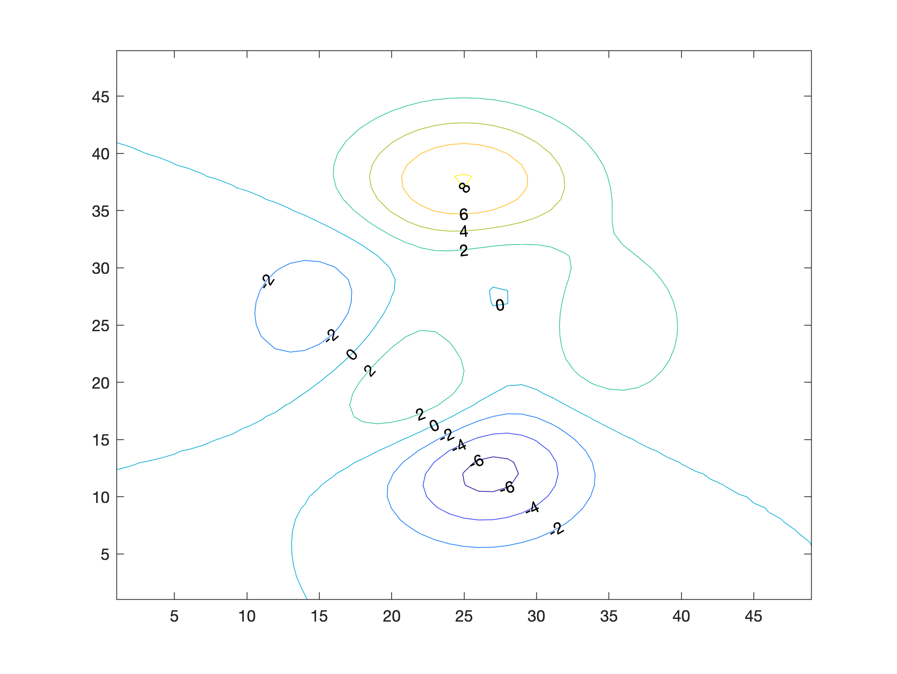

# MATLAB contour labels along a curve

The placement of contour labels by MATLAB's `clabel` can be very
frustrating.  Some control can be gained with `'LabelSpacing'`, but
`clabel` still has a mind of its own.  The user can take full control
with `'manual'` mode, but that doesn't work well in terms of
automation and consistency.

This tool, `clabel_along`, allows the user to specify a curve along
which to place the contour labels.

## Example Use

    [c, h] = contour( peaks );
    clabel_along( c, [1 37], [40 1] );
    clabel_along( c, [25 25], [37.5 30] );
    clabel_along( c, [27.5 27.5], [27 25] );

## Documentation

H = clabel_along( C, X, Y ) labels all contours in C, placing labels
at the intersections between the contours and the curve in X, Y.
Labels are rotated to align with the contour.

H = clabel_along( C, X, Y, V ) as above, but only labels the contours
with levels contained in vector V.  If V is empty (default), then all
contours are labeled.

H = clabel_along( C, X, Y, V, ROTATE ) as above, but ROTATE is a
boolean flag to enable label rotation.  If ROTATE is TRUE (default),
then the labels are rotated.  The rotation angle is based on the slope
of the contour at the intersection point and is corrected for the
aspect ratio of the data and the plot.

If the data or plot aspect ratios change significantly after the call
to clabel_along, the labels may not look properly aligned.

The graphics handles for all of the labels are returned in H.

## Dependencies

`clabel_along` requires Douglas Schwarz's
[intersections](https://www.mathworks.com/matlabcentral/fileexchange/11837)
routine to calculate the intersectinos between the curve and the contours.

## License

This software is Copyright (c) Rob McDonald 2021 and is released under the terms specified in the [license](license.txt).

